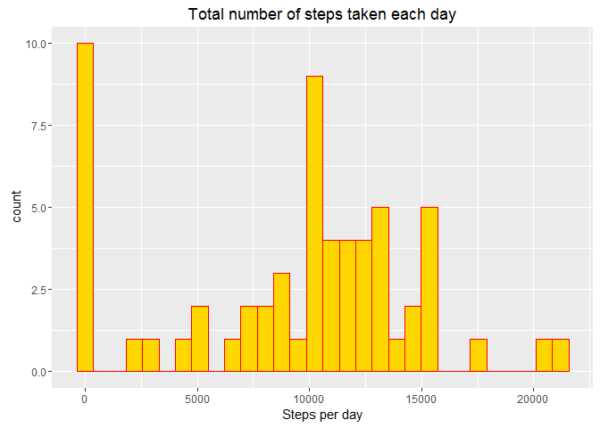
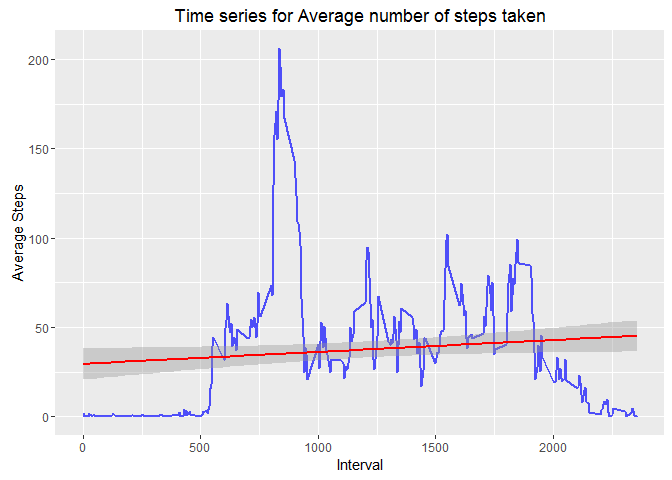
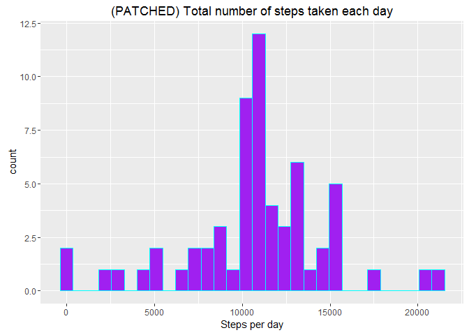
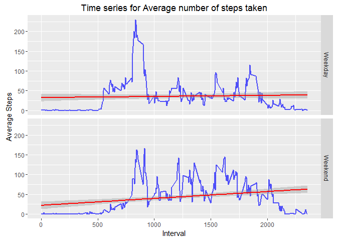

# PA1_template.Rmd


## Activity Monitoring Data


### What is mean total number of steps taken per day?

```r
stepsPerDay <- with(activity, aggregate(steps, by=list(date), FUN=sum, na.rm=TRUE))
colnames(stepsPerDay) <- c("Date","Steps")

# ggplot2 help
# http://www.statmethods.net/advgraphs/ggplot2.html
# https://www.r-bloggers.com/how-to-make-a-histogram-with-ggplot2/
par(mar = c(4,4,2,2))
pal <- colorRampPalette(c("gold","red"))
q <- qplot(stepsPerDay$Steps)
q <- q + geom_histogram(fill=pal(1), col=pal(2)[2]) 
q <- q + labs(title = "Total number of steps taken each day")
q <- q + xlab("Steps per day")
print(q)
```

```
## `stat_bin()` using `bins = 30`. Pick better value with `binwidth`.
## `stat_bin()` using `bins = 30`. Pick better value with `binwidth`.
```

<!-- -->

### Mean and median number of steps taken each day?

```r
stepsPerDay.mean <- mean(stepsPerDay$Steps,na.rm = TRUE)
```
The mean steps per day is 9354.2295082.


```r
stepsPerDay.median <- median(stepsPerDay$Steps,na.rm = TRUE)
```
The median steps per day is 10395.

### Time series plot of average number of steps taken

```r
avgSteps <- aggregate(activity$steps, by=list(activity$interval), mean, na.rm=TRUE)
colnames(avgSteps) <- c("Interval","Steps")
g <- ggplot(avgSteps, aes(Interval, Steps))
g <- g + geom_line(color = "blue", size = 1, alpha=2/3)
g <- g + labs(title = "Time series for Average number of steps taken")
g <- g + xlab("Interval") + ylab("Average Steps")
g <- g + geom_smooth(method = "lm", se = TRUE, col = "red")
g
```

<!-- -->

### 5-minute interval that contains the maximum number of steps 
The 5-minute interval that contains the maximum number of steps is

```r
maxInterval <- avgSteps[which.max(avgSteps$Steps),]
print(maxInterval, type = "html")
```

```
##     Interval    Steps
## 104      835 206.1698
```

### Filling missing values 

```r
completeCases <- complete.cases(activity)
# TRUE=Complete cases, FALSE=Incomplete cases
table(completeCases)
```

```
## completeCases
## FALSE  TRUE 
##  2304 15264
```
We need to patch 2304 missing values in the dataset.

Patch using mean value for each 5-minute interval as approximate.

```r
activity1 <- read.csv("activity.csv",header = TRUE, sep = ",", colClasses = colClass)
patch.count <- 0

for(i in seq_along(activity1$interval)) {
  if(is.na(activity1[i,"steps"])) {
    patch.count <- patch.count + 1
    activity1[i,"steps"] <- avgSteps[which(avgSteps$Interval == activity1[i,"interval"]),"Steps"]
  }
}

print(c("Values patched:", patch.count), quote = FALSE)
```

```
## [1] Values patched: 2304
```

### (AFTER PATCHING) What is mean total number of steps taken per day?

```r
stepsPerDay1 <- with(activity1, aggregate(steps, by=list(date), FUN=sum, na.rm=TRUE))
colnames(stepsPerDay1) <- c("Date","Steps")

pal <- colorRampPalette(c("purple","cyan"))
q <- qplot(stepsPerDay1$Steps)
q <- q + geom_histogram(fill=pal(1), col=pal(2)[2]) 
q <- q + labs(title = "(PATCHED) Total number of steps taken each day")
q <- q + xlab("Steps per day")
print(q)
```

```
## `stat_bin()` using `bins = 30`. Pick better value with `binwidth`.
## `stat_bin()` using `bins = 30`. Pick better value with `binwidth`.
```

<!-- -->

Noticed that the 0 steps/day count has dropped drastically after patching.

### Average number of steps taken per 5-minute interval across weekdays and weekends

```r
weekendFinder <- function(date) {
  dayOfWeek <- format(date,"%A")
  if(grepl("Saturday|Sunday", dayOfWeek, ignore.case = TRUE)) {
    return("Weekend")
  }
  return("Weekday")
}
activity1$day <- sapply(activity1$date,FUN = weekendFinder) # cannot use lapply here

avgSteps1 <- aggregate(steps ~ interval + day, data=activity1, FUN=mean, na.rm=TRUE)

g <- ggplot(avgSteps1, aes(interval, steps))
g <- g + facet_grid(day ~ .)
g <- g + geom_line(color = "blue", size = 1, alpha=2/3)
g <- g + labs(title = "Time series for Average number of steps taken")
g <- g + xlab("Interval") + ylab("Average Steps")
g <- g + geom_smooth(method = "lm", se = TRUE, col = "red")
g
```

<!-- -->
